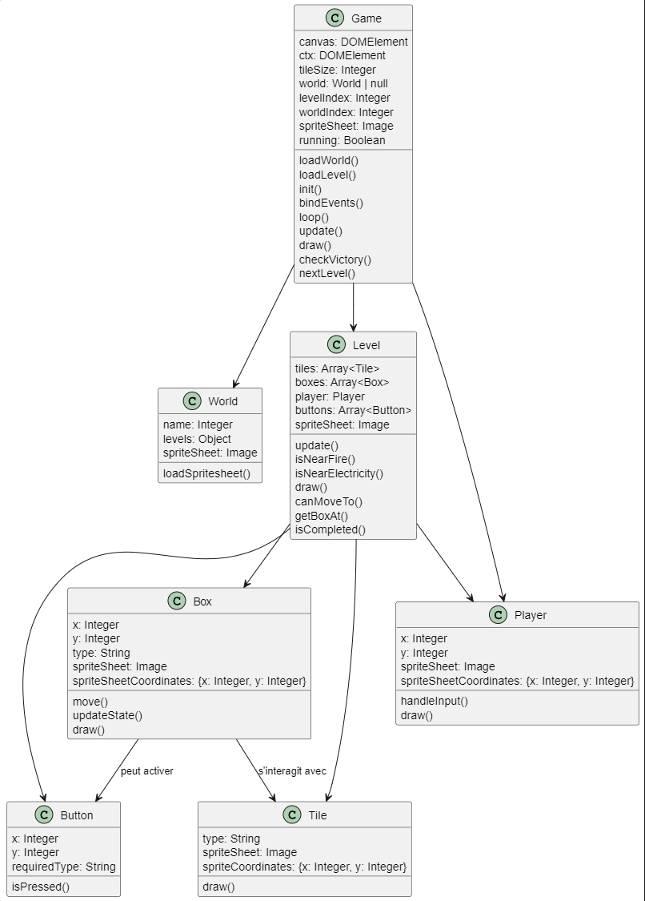

# Sokoban

This is a project I made in two small weeks. The goal was to create a sokoban-like with added features.

## basic Sokoban

The base game allows the player to move around in a 2D grid-based space and move boxes. The player cannot move more than one box at a time. To succeed the player should put all the boxes on the buttons.

## added features

I wanted to add some new gameplay elements to the base game :

- Boxes have a type (wood or metal).
- Depending on the type, the Boxes can either be set on fire or electrified.
- Buttons can have requirements : only valid if pressed on by a burning box or an electrified box.
- The game uses a sprite sheet system so a level in world N will use spritesheet N.

## Class diagram

